# 🕵️‍♂️ Méga-Audit Technique — Bourbon.IA

> **Auditeur :** Claude Opus 4.6 — Mode Architecte Système  
> **Date :** 2026-07-18  
> **Périmètre :** Frontend React/Vite + Backend FastAPI/Python + Intégration GroqCloud  
> **Commit audité :** `0237ed4` (branche `main`)

---

## 1. État des Lieux et Architecture Actuelle

### 1.1 Cartographie du flux de données

```mermaid
graph LR
    A["Utilisateur<br/>(Splash Screen)"] --> B["ImportPanel.jsx<br/>Upload JSON / Collage"]
    B -->|"JSON brut AN"| C["App.jsx handleImport()"]
    C -->|"POST /api/normalize"| D["FastAPI normaliser_amendement()"]
    D -->|"JSON plat"| C
    C -->|"setState"| E["AmendmentTable.jsx<br/>Affichage immédiat"]
    E -->|"Clic Bouton IA"| F["App.jsx handleClassify()"]
    F -->|"POST /api/analyze"| G["FastAPI analyze_endpoint()"]
    G -->|"Étape 0"| H["normaliser_amendement()"]
    H -->|"Étape 1"| I["sorting_engine.py<br/>trier_amendements()"]
    I -->|"Étape 2"| J["Routeur LLM Fallback<br/>asyncio.Semaphore(4)"]
    J -->|"API Call"| K["GroqCloud API"]
    K -->|"JSON LLM"| J
    J -->|"AnalyzeResult[]"| F
    F -->|"setState"| L["AmendmentTable.jsx<br/>+ GroupeBadge.jsx<br/>Affichage classé"]
```

**Détail du flux :**

| Étape | Fichier | Action |
|-------|---------|--------|
| 1. Entrée | `ImportPanel.jsx` | L'utilisateur importe un ou plusieurs fichiers JSON bruts de l'AN, ou colle du JSON manuellement. Le parsing gère 6 formats d'entrée différents. |
| 2. Normalisation | `App.jsx` → `classify.js` → `POST /api/normalize` | Le JSON brut est envoyé au backend Python qui l'aplatit via `normaliser_amendement()`. Le front reçoit un tableau d'objets plats (`id`, `numero`, `article`, `auteurs`, `dispositif`, etc.). |
| 3. Affichage | `AmendmentTable.jsx` | Le tableau s'affiche immédiatement avec les données normalisées. Aucune IA n'est encore intervenue. |
| 4. Classement IA | `App.jsx` → `classify.js` → `POST /api/analyze` | Les données normalisées sont renvoyées au backend. L'endpoint re-normalise (doublon), trie mécaniquement, puis envoie chaque amendement au LLM. |
| 5. Retour IA | `AmendmentTable.jsx` + `GroupeBadge.jsx` | Les résultats (`statut`, `justification`, `alerte_couleur`) sont rattachés aux amendements via leur `id` et le tableau se met à jour. |

### 1.2 Modèles IA configurés (Routeur LLM / Fallback)

Définis dans [index.py](file:///Users/jujutravail/bourbon-ia/api/index.py#L125), ligne 125 :

| Priorité | Modèle | Rôle |
|----------|--------|------|
| 1 (Principal) | `llama-3.1-8b-instant` | Rapide, quotas généreux, priorité de premier choix |
| 2 (Secours) | `qwen/qwen3.6-27b` | Plus puissant, backup si le 8B est saturé |
| 3 (Dernier recours) | `llama-3.3-70b-versatile` | Le plus capable mais quota TPD déjà épuisé historiquement |

---

## 2. Vérification des Failsafes (Sécurité & Stabilité)

### 2.1 Le Routeur LLM bascule-t-il correctement en cas d'erreur 429 ?

**✅ OUI — Implémentation correcte.**

Justification : La boucle `for model_name in FALLBACK_MODELS:` (lignes 139-178 de [index.py](file:///Users/jujutravail/bourbon-ia/api/index.py#L139-L178)) encapsule l'appel Groq dans un `try/except`. Le bloc `except` vérifie explicitement la présence des chaînes `"429"`, `"rate limit"` et `"quota"` dans le message d'erreur (ligne 174). Si détecté, un `logging.warning` est émis et `continue` fait passer au modèle suivant. Si tous les modèles échouent, une `HTTPException(500)` est levée (ligne 181).

> [!WARNING]
> **Nuance :** La détection repose sur un `str(e).lower()` — c'est une heuristique par sous-chaîne, pas une inspection du code HTTP structuré de l'exception OpenAI. Cela fonctionne en pratique avec le SDK `openai`, mais une erreur 500 côté Groq contenant le mot "rate" dans son message pourrait déclencher un faux positif de bascule.

### 2.2 Le Normaliseur Python est-il blindé contre les clés manquantes ?

**✅ OUI — Solidement protégé.**

Justification : La fonction [normaliser_amendement()](file:///Users/jujutravail/bourbon-ia/api/index.py#L53-L78) utilise systématiquement des `.get()` chaînés avec des dictionnaires vides comme valeurs par défaut (`am.get("identification", {}).get("numeroLong", "Inconnu")`). Aucun accès direct par crochet `[]` n'est présent. Si la clé `"amendement"` est absente, la fonction retourne `data` tel quel (ligne 78).

> [!NOTE]
> **Point d'attention :** Il n'y a pas de `try/except` global autour de la fonction. Si `data` n'est pas un `dict` (ex: l'utilisateur envoie une chaîne ou `null` dans la liste), l'appel `"amendement" in data` lèvera un `TypeError`. C'est un cas limite peu probable mais non protégé.

### 2.3 Le Frontend intercepte-t-il correctement les erreurs HTTP ?

**✅ OUI — Couverture satisfaisante.**

| Code HTTP | Intercepté ? | Mécanisme |
|-----------|-------------|-----------|
| 422 (Validation Pydantic) | ✅ Oui | `!response.ok` dans [classify.js](file:///Users/jujutravail/bourbon-ia/src/api/classify.js#L54-L57) lève une `ClassifyError` |
| 500 (Erreur serveur) | ✅ Oui | Même mécanisme `!response.ok` |
| 504 (Gateway Timeout) | ✅ Oui | Même mécanisme `!response.ok` |
| Erreur réseau (serveur injoignable) | ✅ Oui | Le `catch` autour du `fetch` (lignes 47-52) lève une `ClassifyError` dédiée |

L'erreur remonte dans `App.jsx` via le `catch` de [handleClassify()](file:///Users/jujutravail/bourbon-ia/src/App.jsx#L63-L64) et s'affiche dans la bannière rouge du composant [ClassifyButton.jsx](file:///Users/jujutravail/bourbon-ia/src/components/ClassifyButton.jsx#L22-L26).

---

## 3. Zones d'Ombres et Angles Morts (🔴 Alerte Rouge)

### 3.1 🔴 Le Risque de Timeout Vercel (10 secondes)

**Verdict : NON GÉRÉ — Risque critique.**

Le plan Hobby de Vercel impose un timeout strict de **10 secondes** pour les Serverless Functions. Voici le calcul :
- Avec 24 amendements et un `Semaphore(4)`, il y a 23 appels LLM à traiter en lots de 4.
- Cela donne ≈ 6 lots séquentiels. Si chaque appel Groq prend 1.5-2s, le total est de **9-12 secondes**.
- Avec le fallback (retry sur un second modèle en cas de 429), le temps peut **doubler**.

Le `timeout=300.0` du client OpenAI (ligne 103 de `index.py`) ne sert à rien car Vercel coupe **avant** le client. L'utilisateur recevra un 504 opaque sans message explicatif.

> [!CAUTION]
> **Impact :** C'est le vecteur de crash n°1 en production. 20+ amendements = timeout quasi garanti.

### 3.2 🟡 Double Normalisation (Gaspillage de CPU)

**Verdict : Inefficacité détectée.**

Le flux actuel normalise **deux fois** les mêmes données :
1. **À l'import** : `handleImport()` → `POST /api/normalize` → les données reviennent plates.
2. **Au classement** : `handleClassify()` envoie ces données *déjà plates* à `/api/analyze`, qui exécute de nouveau `normaliser_amendement()` sur chacune (ligne 88).

La seconde normalisation ne fait rien de plus (la condition `if "amendement" in data` est `False` pour des données déjà aplaties, donc elle retourne `data` tel quel). Ce n'est pas un bug fonctionnel, mais c'est une boucle inutile de 24 itérations à chaque classement.

### 3.3 🔴 Désynchronisation du Contrat Frontend ↔ Backend

**Verdict : Incohérence structurelle critique.**

Le backend `/api/analyze` retourne un `List[AnalyzeResult]` avec 4 champs : `id`, `statut`, `justification`, `alerte_couleur`.

Or, le frontend dans [App.jsx handleClassify()](file:///Users/jujutravail/bourbon-ia/src/App.jsx#L46-L58) attend un objet `{ classement, avertissements, modele_utilise }` — et accède à des propriétés **qui n'existent pas dans `AnalyzeResult`** :
- `result.classement` → Le backend renvoie un tableau brut, pas un objet enveloppé. C'est `classify.js` (ligne 68) qui compense en créant un wrapper `{ classement: data }`.
- `res.rang` → Utilisé pour le tri (ligne 56), mais **`rang` n'est jamais renvoyé** par le backend. Tous les `.rang` valent `undefined`, le tri fait `Infinity - Infinity = NaN` → **le tri ne fait rien**.
- `res.groupe` → Utilisé par `AmendmentDetail.jsx` (ligne 69) et `computeGroupSpans()` (ligne 46), mais **`groupe` n'est jamais renvoyé** par le backend. Tous les crochets Dc./Id. du tableau sont donc **toujours vides**.

> [!CAUTION]
> **Impact :** Les fonctionnalités visuelles de regroupement (crochets Dc./Id.) et de tri par rang sont **mortes silencieusement**. Elles s'affichent comme si rien ne s'était passé, mais ne fonctionnent pas.

### 3.4 🟡 Pydantic : Le modèle est-il trop strict ?

**Verdict : NON — Le modèle est trop permissif.**

Le modèle [AnalyzeRequest](file:///Users/jujutravail/bourbon-ia/api/index.py#L43-L45) est défini comme `amendements: list` (un `list` générique non typé). Cela accepte absolument n'importe quoi — il n'y a aucun risque de rejet 422 lié au payload.

Le vrai risque est l'inverse : un payload malformé (ex: `amendements: "coucou"`) passerait la validation Pydantic et ferait crasher `normaliser_amendement()` plus tard.

### 3.5 🟡 Rendu React : Problèmes dans AmendmentTable.jsx

| Problème | Sévérité | Détail |
|----------|----------|--------|
| **Clé React instable** | 🟡 Moyenne | `key={a.id \|\| index}` (ligne 151). Si `a.id` est `undefined` pour les 3 premiers éléments, ils auront tous `key=0,1,2` — correct, mais les clés changent si on insère des éléments. Le fallback `index` rend le drag-and-drop imprévisible car React ne peut pas distinguer les éléments déplacés. |
| **`computeGroupSpans` appelle `a.id` comme clé de Map** | 🟡 Moyenne | Si `a.id` est `undefined`, `spans.set(undefined, ...)` écrase l'entrée à chaque itération. Seul le dernier amendement sans `id` serait dans la Map. |
| **Re-rendus inutiles** | 🟢 Faible | Les fonctions `handleDragStart`, `handleDrop`, etc. sont recréées à chaque rendu. Ce n'est pas critique vu la taille des tableaux (< 100 lignes). |
| **Calculs de comptage** | 🟢 Faible | Les 4 appels `.filter()` (lignes 99-111) parcourent le tableau entier 4 fois. Un seul `reduce` suffirait. Négligeable en pratique. |

### 3.6 🟡 Import `extraire_texte_brut` devenu inutile

La fonction [extraire_texte_brut](file:///Users/jujutravail/bourbon-ia/api/llm_processor.py#L8-L40) de `llm_processor.py` est toujours importée (ligne 22 de `index.py`) mais **n'est plus jamais appelée** dans le code depuis que `normaliser_amendement()` l'a remplacée. C'est du code mort.

### 3.7 🟡 Dépendances fantômes dans requirements.txt

| Paquet | Utilisé ? | Verdict |
|--------|-----------|---------|
| `fastapi` | ✅ Oui | OK |
| `uvicorn` | ⚠️ Local seulement | Non utilisé par Vercel Serverless |
| `pydantic` | ✅ Oui | OK |
| `requests` | ❌ Non | Jamais importé nulle part |
| `sqlalchemy` | ❌ Non | Jamais importé nulle part |
| `httpx` | ❌ Non | Jamais importé nulle part |
| `openai` | ✅ Oui | OK |
| `python-dotenv` | ✅ Oui | OK |

4 paquets sur 8 sont **inutiles**, ce qui alourdit le cold start de la Serverless Function Vercel (chaque `import` coûte du temps).

### 3.8 🟡 Sécurité CORS : allow_origins=["*"]

L'API accepte n'importe quelle origine (ligne 38 de `index.py`). Acceptable pour un hackathon, mais à verrouiller impérativement en production.

---

## 4. Recommandations d'Action Immédiate

### 🔴 Priorité Critique (Bloquant pour la démo)

1. **Compléter le contrat `AnalyzeResult` pour inclure `rang` et `groupe`.**  
   Le backend doit renvoyer un `rang: int` (position dans le tri mécanique) et un `groupe: dict` (avec `type` et `groupe_id`) pour que le tri frontend, les crochets Dc./Id. du tableau, et l'export RTF fonctionnent réellement. Sans cela, 3 fonctionnalités majeures de l'UI sont des coquilles vides.

2. **Implémenter un traitement en streaming ou par lots (chunking) pour esquiver le Timeout Vercel de 10s.**  
   Deux approches possibles :
   - **Option A (Rapide) :** Découper le lot côté frontend en sous-groupes de 5 amendements maximum et envoyer N requêtes séquentielles à `/api/analyze`. Chaque requête prend ~2-3s, bien sous la limite.
   - **Option B (Propre) :** Implémenter un endpoint SSE (Server-Sent Events) qui stream les résultats un par un au frontend, permettant un affichage progressif des badges.

### 🟡 Priorité Haute (Stabilité)

3. **Supprimer la double normalisation** en retirant l'appel `normaliser_amendement()` de `/api/analyze` (le front envoie des données déjà normalisées). Alternativement, ajouter un guard `if "amendement" not in data: return data` au tout début (ce qui existe déjà, mais la boucle est inutile).

4. **Nettoyer `requirements.txt`** en supprimant `requests`, `sqlalchemy`, et `httpx`. Cela réduira le cold start Vercel de plusieurs centaines de millisecondes.

5. **Ajouter un `try/except TypeError` dans `normaliser_amendement()`** pour protéger contre des entrées non-`dict` dans la liste des amendements (ex: `null`, chaîne, entier).

---

> **Conclusion :** L'architecture est saine et le routeur LLM avec fallback est bien pensé. Les deux points bloquants sont le **timeout Vercel** (qui rend le traitement de 20+ amendements impossible) et le **contrat `AnalyzeResult` incomplet** (qui rend les fonctionnalités de regroupement et de tri visuel inopérantes). La correction de ces deux points transformerait la démo d'un état "partiellement fonctionnel" à "pleinement opérationnel pour le jury".
