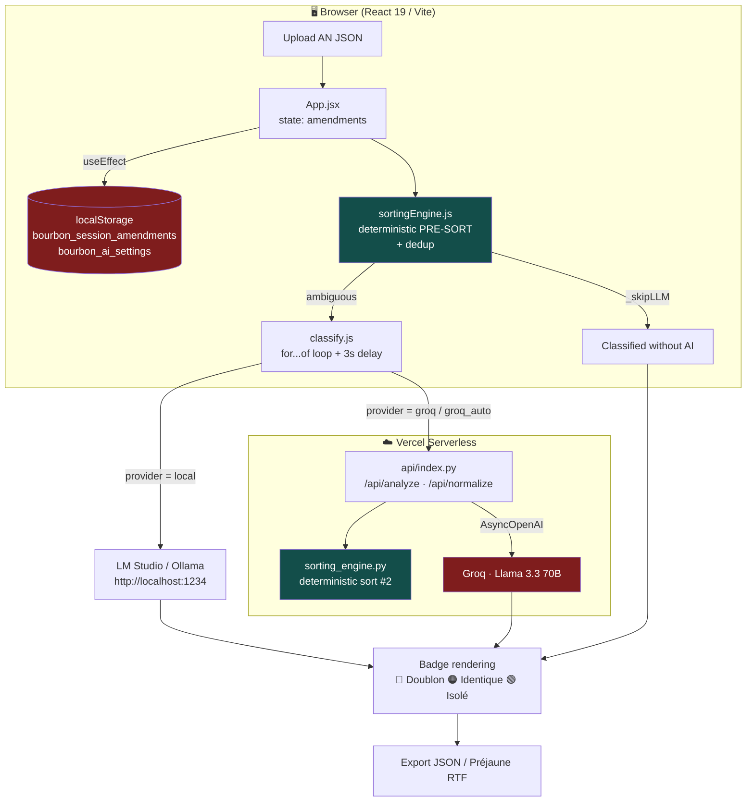
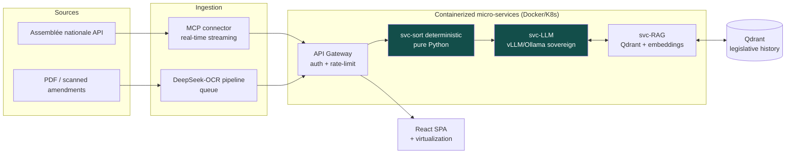

# 🏛️ 360° Technical, UX & Architecture Audit — Bourbon.IA

> **Scope.** Exhaustive audit of the stabilized MVP V1 (commit `45391c6`).
> **Roles.** Principal Software Architect · Security Expert · Lead AI Engineer.
> **Stack audited.** React 19 + Vite + Tailwind · FastAPI serverless (Vercel, `api/index.py`) ·
> agnostic hybrid LLM (LM Studio/Ollama local ↔ Groq/Llama 3.3 70B cloud).
> **Method.** Source-code review (`src/`, `api/`), request logic (`src/api/classify.js`),
> pre-sort (`src/utils/sortingEngine.js`), export (`src/utils/exportRtf.js`, `App.jsx`),
> and documentation (`README.md`, `ARCHITECTURE.md`, `DEFI.md`).

---

## 0. Executive summary

Bourbon.IA V1 is an **impressive hackathon MVP**: putting an infallible deterministic sort
ahead of an agnostic LLM is architecturally sound, and the UX (progressive escalation,
reasoning mode, RTF "préjaune" export) is polished.

**However**, three blind spots threaten the core promise — sovereignty — and scalability:

1. 🔴 **Confidentiality is not upheld by default.** The default mode sends amendments to a
   third-party cloud (Groq/US), and **legislative data is written in cleartext to
   `localStorage`** (session auto-save). For a non-public text, that is a leak.
2. 🔴 **Scaling to 3,000 amendments will crash the UI.** O(n²) re-render during escalation
   + full `localStorage` write on every iteration + a non-virtualized table.
3. 🟠 **LLM resilience is partly fake.** The fallback-model list (`FALLBACK_MODELS`) is dead
   code; the fallback loop iterates over a single model.

Details, prioritized and actionable, follow. The **matrix in §5** is the action plan.

---

## 1. Diagnosis of the current architecture (MVP V1)

### 1.1 Overview (diagram)

```mermaid
flowchart TD
    subgraph NAV["🖥️ Browser (React 19 / Vite)"]
        U[Upload AN JSON] --> APP[App.jsx<br/>state: amendments]
        APP -->|useEffect| LS[(localStorage<br/>bourbon_session_amendments<br/>bourbon_ai_settings)]
        APP --> PRE[sortingEngine.js<br/>deterministic PRE-SORT<br/>+ dedup]
        PRE -->|_skipLLM| DIRECT[Classified without AI]
        PRE -->|ambiguous| CLS[classify.js<br/>for...of loop + 3s delay]
    end

    CLS -->|provider = local| LM[LM Studio / Ollama<br/>http://localhost:1234]
    CLS -->|provider = groq / groq_auto| VER

    subgraph VERCEL["☁️ Vercel Serverless"]
        VER[api/index.py<br/>/api/analyze · /api/normalize]
        VER --> ST[sorting_engine.py<br/>deterministic sort #2]
        VER -->|AsyncOpenAI| GROQ[Groq · Llama 3.3 70B]
    end

    LM --> RENDER[Badge rendering<br/>🔴 Doublon 🟠 Identique 🟢 Isolé]
    GROQ --> RENDER
    DIRECT --> RENDER
    RENDER --> EXP[Export JSON / Préjaune RTF]

    style LS fill:#7f1d1d,color:#fff
    style GROQ fill:#7f1d1d,color:#fff
    style PRE fill:#134e4a,color:#fff
    style ST fill:#134e4a,color:#fff
```

### 1.2 Edge computing & front-end pre-sort — **sound but needs hardening**

**What's good.** The client pre-sort (`src/utils/sortingEngine.js:preSortAmendements`) is a
strong idea: it sorts by `(article → action priority → number)` with
`localeCompare(..., { numeric: true })` — **which is more correct than the server engine**
`api/sorting_engine.py`, which only sorts by `(priority, number)` and **ignores article
order** (yet the doctrine states article sequential order comes first). Mechanical dedup
(`article + dispositif` normalized) avoids calling the LLM on obvious identicals → real
token savings.

**Flaws.**
- 🔴 **Identiques / Doublons confusion.** The pre-sort groups any identical body under
  `type: 'identiques'` **without distinguishing the author** (`sortingEngine.js:86-95`). But
  the AN doctrine is explicit: same body + **different** authors = *identiques* (admissible);
  same body + **same** author = *doublon* (inadmissible). The current code labels an
  inadmissible doublon as a plain admissible identique → **a business-rule error**.
- 🟠 **Two divergent sort engines** (JS client vs Python server) applying different rules.
  Risk of inconsistent ordering depending on the path taken.
- 🟠 **Fragile chapeau regex**: `startsWith("supprimer cet article")` misses
  "I. – Supprimer cet article" (paragraph prefix), "À l'article 5, supprimer…", etc. Many
  real amendments have a compound chapeau.

### 1.3 Security & confidentiality — **the sovereignty promise is not met by default**

- 🔴 **Legislative data persisted in cleartext to `localStorage`.**
  `App.jsx:25-27` serializes the **entire** amendments array (dispositif, exposé, authors) on
  every state change. On a shared Assemblée workstation, that data remains readable after the
  session, indefinitely, unencrypted. For a **non-public text under review**, this is
  incompatible with the claimed "absolute confidentiality".
- 🔴 **Cloud by default.** The default provider is `groq` / `groq_auto`
  (`App.jsx:43`, `AISettingsModal.jsx:4`): **without any user action, amendments are sent to
  Groq (a US third party).** The warning is only passive (footer `App.jsx:266`), never a
  blocking consent step.
- 🔴 **CORS `allow_origins=["*"]`** on `/api/analyze` (`api/index.py:35`). In `groq_auto`
  mode the endpoint relays to Groq **with the server key** (`GROQ_API_KEY`, `index.py:151`).
  Any third-party site can therefore call your API and **consume your Groq quota** (quota
  theft / cost). Restrict to the Vercel domain.
- 🟠 **Personal API key in `localStorage`** (`bourbon_ai_settings`). The input is
  `type=password`, but storage is cleartext → exfiltrable via any XSS flaw. The "never stored
  on our servers" message is true but incomplete (it lives in the browser).
- 🟠 **Versioned `.env`** (`amendements-front/.env`): today it only holds a URL, but a
  Git-tracked `.env` in a **public** repo is a time bomb for a future key. `git rm --cached`
  + `.gitignore`.

### 1.4 React UI robustness & performance — **will not scale**

- 🔴 **O(n²) re-render during escalation.** For each amendment, `onProgress`
  (`App.jsx:91-104`) calls `setAmendments(prev => …findIndex…)`. Each update = array copy
  **+** O(n) `findIndex` **+** re-render of the whole `AmendmentTable` (all rows) **+** (via
  `useEffect`) a **full** `JSON.stringify` to `localStorage`. For *n* amendments → **≈ O(n²)**
  with a large constant.
- 🔴 **Non-virtualized table** (`AmendmentTable.jsx:137`). `amendments.map(...)` renders
  **all** rows (with drag handlers). 3,000 amendments = 3,000 DOM rows → freeze/crash. There
  is only a `max-height` scroll container, **no pagination or windowing**.
- 🔴 **Massive import → `localStorage` quota (~5 MB) exceeded.** 3,000 enriched amendments can
  exceed the quota → **unhandled** `QuotaExceededError` (`App.jsx:26`) → auto-save silently
  breaks, or the render crashes.
- 🔴 **Memory leak / background loop not stopped.** Specifics:
  * **No unmount cleanup**: missing a `useEffect(() => () => { abortRef.current = true;
    clearInterval(timerRef.current) }, [])`. If the user leaves the view (SPA) mid-processing,
    the async loop keeps running, calls `setState` on an unmounted tree (React warning + leak),
    and the chronometer `setInterval` **keeps ticking**.
  * **`abortRef` cancels neither the `fetch` nor the `setTimeout(3s)`** (`classify.js:100`,
    `:213`). "Stop" only interrupts between iterations: the in-flight request and the 3 s wait
    still complete. No `AbortController` is passed to `fetch`.
  * **Tab close**: JS halts, but already-dispatched Groq requests are still billed; there is no
    `navigator.sendBeacon`/`beforeunload` to signal a stop.

---

## 2. AI agnosticism & LLM resilience audit

### 2.1 Local vs Cloud model handling & verbose (reasoning) models

- ✅ **Good instinct**: dynamic `max_tokens` (`classify.js:61` — 16384 in reasoning vs 4096)
  and adapted `temperature` (0.6 reasoning / 0.1 direct).
- 🟠 **The CoT of verbose models (Bonsai-27B, QwQ-32B) breaks extraction.** The reasoning
  prompt asks for the JSON "at the VERY END" (`classify.js:58`), but the extractor takes
  **from the first `{` to the last `}`** (`classify.js:139-145`). If the reasoning contains
  braces (e.g. a JSON example, a formula, `{…}`), extraction captures noise. It should take
  **the last balanced JSON block**, not the widest span.
- 🟠 **`<think>…</think>` tags** are not stripped server-side: local reasoning models emit
  them; only the luck of brace-extraction saves parsing.

### 2.2 Prompt engineering & JSON extraction — **fragile**

- 🔴 **Pairwise-vs-reference clustering, not true grouping.** Each amendment is compared only
  to the **first** in the batch (`classify.js:63,120`; `index.py:190,208`). Two amendments
  identical to each other but different from the first **will never be grouped**. Identiques/DC
  detection is therefore structurally incomplete.
- 🟠 **Divergent extractors**: client `indexOf/lastIndexOf`; server `re.search(r'\[.*\]|\{.*\}', DOTALL)`
  (`index.py:231`) — greedy, same fragility. Two implementations to maintain.
- 🟠 **Inconsistent statuses**: the prompt enforces `Identique | Discussion commune | Isolé`
  (`classify.js:59`), yet the code also maps `Doublon`, `Incompatible`, `Nouveau`
  (`index.py:243`, `AmendmentTable.jsx:100-111`). The LLM can never return `Doublon` → **the
  red "Doublon" color is dead code** on the LLM output path.

### 2.3 Network & mixed requests (Mixed Content) — **real risk on LAN IPs**

- ✅ **`http://localhost:1234` is NOT blocked**: `localhost` is a *potentially trustworthy
  origin* (browser exception), even from an HTTPS page.
- 🔴 **But a LAN/Tailscale IP is.** As soon as the user points `localUrl` at
  `http://100.78.180.81:1234` (Justin's PC IP, cf. `audit_equipe.md`), the HTTPS Vercel page
  **blocks the request as Mixed Content**. The "local over network" mode (the real sovereign
  case) is therefore **broken in production** as-is. Fixes: local HTTPS proxy, a tunnel
  (Tailscale HTTPS / `caddy`), or running the front locally (http) on the network.

### 2.4 Resilience — **partly fake**

- 🔴 **`FALLBACK_MODELS` is dead code.** Defined at `index.py:199`, but the loop iterates
  `for model_name in [effective_model]` (`index.py:213`) → **a single model**. On a 429
  rate-limit, no fallback model is actually tried server-side. The advertised "resilience"
  does not exist.
- 🟠 **De-facto serialization.** The client awaits each response **then** sleeps 3 s
  (`classify.js:213`) in a `for...of await`. The server parallelism (`asyncio.gather`,
  `sem=4`, `index.py:200,268`) is **never used** in the real flow, since the client sends only
  2 amendments per call, sequentially. Result: **3,000 amendments ≈ 2h30** (3 s × 3,000 +
  latency), a non-starter.

---

## 3. User experience (UX/UI) & brand audit

### 3.1 Ergonomics — **polished**

- ✅ Rich feedback: `elapsed` chronometer (setInterval 1 s, `App.jsx:82`), `current/total`
  counter, warnings, reasoning toggle, Stop button. Progressive escalation (`onProgress`)
  feels "alive".
- ✅ Dark/Light via `ThemeToggle`, amendment detail, drag-and-drop manual reordering
  (`handleReorder`), delete with confirmation.
- 🟠 **Inconsistent brand color.** The stated brand red is `#e3001b`, but the code uses
  **`#D91227`** (`App.jsx:287`, `AmendmentTable.jsx:153`, shadows `rgba(217,18,39,…)`). Align
  to a single design token.
- 🟠 **No duration estimate** before a large batch: the user has no idea about the potential
  ~2h30 (cf. §2.4). Show an ETA based on `total × (latency + 3 s)`.

### 3.2 Sovereignty & GDPR — **insufficient warning** 🔴

- The Local → Cloud switch is only signaled **passively** (footer `App.jsx:266`, landing text
  `App.jsx:294`, a note in the `groq_auto` modal). **No active, blocking consent** before
  sending potentially confidential text to Groq.
- Recommendation: an **explicit consent modal** on the first cloud-mode classification
  ("⚠️ These amendments will be sent to Groq, a US-hosted third-party service. Confirm?"), plus
  a **permanent status badge** (🔴 Cloud / 🟢 Local) visible at the top of the page throughout
  processing.

### 3.3 Export integrity — **good, with two nuances**

- ✅ **Complete JSON export.** `handleExport` (`App.jsx:164-177`) serializes
  `{ amendements: amendments }` — **including `resultat_ia`** (statut, justification,
  alerte_couleur, rang, groupe). The AI-enriched data **is captured**.
- ✅ **RTF préjaune export** (`exportRtf.js`) reconstructs the Dc./Id. brackets from
  `resultat_ia.groupe` — a nice deliverable, faithful to the official format.
- 🟠 **Text title never rendered**: the RTF reads `amendments[0].texte_examine?.titre`
  (`exportRtf.js:104`), a field **never populated** by `normaliser_amendement` → the title
  header is always missing.
- 🟠 **No Excel export** despite the "JSON/Excel/RTF" promise in the brief (`DEFI.md`).

---

## 4. Technical strategy & roadmap (V2)

### 4.1 Target V2 architecture (diagram)

```mermaid
flowchart LR
    subgraph SRC["Sources"]
        AN[Assemblée nationale API]
        PDF[PDF / scanned amendments]
    end

    subgraph INGEST["Ingestion"]
        MCP[MCP connector<br/>real-time streaming]
        OCR[DeepSeek-OCR pipeline<br/>queue]
    end

    subgraph CORE["Containerized micro-services (Docker/K8s)"]
        GW[API Gateway<br/>auth + rate-limit]
        SORT[svc-sort deterministic<br/>pure Python]
        LLM[svc-LLM<br/>vLLM/Ollama sovereign]
        RAG[svc-RAG<br/>Qdrant + embeddings]
    end

    DB[(Qdrant<br/>legislative history)]
    UI[React SPA<br/>+ virtualization]

    AN --> MCP --> GW
    PDF --> OCR --> GW
    GW --> SORT --> LLM
    LLM <--> RAG <--> DB
    GW --> UI
    style LLM fill:#134e4a,color:#fff
    style SORT fill:#134e4a,color:#fff
```

### 4.2 Pillars

**A. MCP connection (Assemblée nationale streaming).**
Expose an internal MCP server (self-hosted, no third party) that wraps the AN feeds. The
front subscribes (SSE/WebSocket via the Gateway) and receives amendments as they arrive.
Feasibility: high (the AN already publishes structured JSON — `normaliser_amendement` already
handles `identification`, `pointeurFragmentTexte`, `signataires`). Effort: medium.

**B. DeepSeek-OCR pipeline (PDF/scanned).**
A queue (Redis/RabbitMQ) → containerized OCR workers (DeepSeek-OCR or docTR) → normalization
to the same flat schema. Process in async batch, never inside the front request. Feasibility:
medium (old-scan OCR quality varies → a human validation step). Effort: high.

**C. RAG & semantic search (Qdrant).**
Index the legislative history (code articles, exposés) in **Qdrant**; embeddings via a
**local** model (sovereignty). On each analysis, inject the relevant top-k to **source** every
AI decision (anti-hallucination, a strong project requirement). AnythingLLM can serve as an
orchestration layer for the POC, Qdrant alone for prod. Effort: medium.

**D. Micro-services (Docker/K8s).**
Split `svc-sort` (deterministic, stateless, horizontally scalable), `svc-LLM` (vLLM/Ollama on
a sovereign GPU), `svc-RAG` (Qdrant), behind an **API Gateway** (auth, rate-limit — fixes the
current CORS `*`). Benefit: the deterministic sort scales independently of the LLM (the
bottleneck). Effort: high, but it's the production trajectory.

---

## 5. Recommendations & risk matrix (actionable plan)

**Priority key:** 🔴 **P0** critical/immediate · 🟠 **P1** important · 🔵 **P2** V2 evolution.

| Prio | Component / File | Issue identified | Recommended solution | Impact |
|:---:|---|---|---|---|
| 🔴 P0 | `App.jsx:25-27` | Legislative data cleartext & persistent in `localStorage` | Persist only on opt-in; encrypt (Web Crypto) or purge on close; GDPR banner | **Security / Sovereignty** |
| 🔴 P0 | `App.jsx:43`, `AISettingsModal` | Cloud (Groq) by default, no blocking consent | Explicit consent modal before any cloud send; permanent 🔴/🟢 status badge | **Sovereignty / GDPR** |
| 🔴 P0 | `api/index.py:35` | CORS `allow_origins=["*"]` → server Groq key abusable | Restrict to the Vercel domain; key rotation; rate-limit | **Security (cost/quota)** |
| 🔴 P0 | `App.jsx:91-104` + `AmendmentTable.jsx:137` | O(n²) re-render + non-virtualized table → crash at 3,000 | `react-window`/pagination; batch updates; `memo` rows | **Performance / Stability** |
| 🔴 P0 | `classify.js:100,213` + `App.jsx` | Loop not cancelled (fetch/timeout/interval) on unmount or Stop | `AbortController` on `fetch`; unmount `useEffect` cleanup; cancel the `setTimeout` | **Stability / Memory leak** |
| 🔴 P0 | `sortingEngine.js:86-95` | Doublons (same author) labeled as admissible identiques | Distinguish by author: same body + same author ⇒ `Doublon` inadmissible | **Business compliance** |
| 🟠 P1 | `api/index.py:199-213` | Dead `FALLBACK_MODELS` → no real 429 resilience | Actually iterate the fallback list on 429/quota | **Resilience** |
| 🟠 P1 | `classify.js:139-145` | JSON extraction "first { → last }" breaks on CoT | Extract the **last balanced JSON block**; strip `<think>` | **AI reliability** |
| 🟠 P1 | `classify.js:63` / `index.py:190` | Pairwise-vs-reference clustering → missed groupings | True clustering (blocking by impact point + intra-cluster comparison) | **Sorting quality** |
| 🟠 P1 | `api/sorting_engine.py:48-62` | Server sort ignores article order (≠ JS engine) | Align with `sortingEngine.js` (article → priority → n°); single source | **Compliance / Consistency** |
| 🟠 P1 | HTTPS Vercel ↔ `http://IP:1234` | Mixed Content blocks the real networked local mode (Tailscale) | HTTPS tunnel (Tailscale/Caddy) or local front; document it | **Operational sovereignty** |
| 🟠 P1 | `amendements-front/.env` | `.env` versioned in a public repo | `git rm --cached` + `.gitignore` | **Security** |
| 🟠 P1 | Brand: `#D91227` vs `#e3001b` | Inconsistent brand color | Centralize in a single design token | **UX / Consistency** |
| 🔵 P2 | Duplicate `api/`+`src/` vs `amendements-backend/`+`amendements-front/` | Two parallel stacks, only one deployed | Consolidate to one base; delete the dead one | **Maintainability** |
| 🔵 P2 | Ingestion | Manual JSON import | **MCP** streaming connector to the AN | **Scalability** |
| 🔵 P2 | AI sourcing | Ungrounded hallucinations | **Qdrant RAG** + local embeddings | **Reliability / Sovereignty** |
| 🔵 P2 | PDF archives | No ingestion of scans | Async **DeepSeek-OCR** pipeline | **Coverage** |
| 🔵 P2 | `index.py` monolith | Sort and LLM coupled | **Micro-services** Docker/K8s + Gateway | **Scalability** |
| 🔵 P2 | Export | No Excel; missing RTF title | Add `.xlsx` export; populate `texte_examine.titre` | **Deliverable completeness** |

---

## 6. Conclusion

The conceptual foundation — **deterministic first, LLM second, local/cloud agnostic** — is the
right one. The **P0** priorities are not refinements but preconditions for the "sovereign,
local, confidential" promise to be **true** and for the tool to **survive a real batch** (the
20,400 amendments of the pension reform cited in the `README`). Addressing the six P0s before
any new feature would turn this very good hackathon MVP into a credible prototype for a pilot at
the Assemblée.

> *Audit produced for internal review — every finding points to a precise code location
> (`file:line`) for immediate action.*
