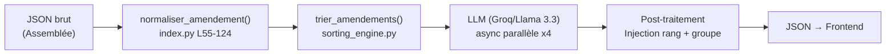
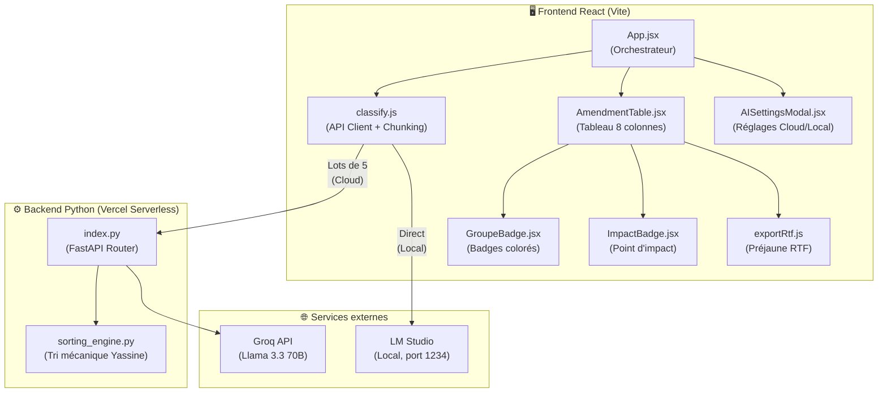

# 🏛️ AUDIT BOURBON.IA — VERSION FINALE V2
> **Date :** 19 Juillet 2026 — Fin de Hackathon Assemblée Nationale  
> **Auditeur :** Lead Architect & QA Engineer  
> **Scope :** Scan 360° de l'architecture, de la résilience et de la scalabilité  
> **Commit audité :** `83919ed` (branche `main`)

---

## 🏁 1. CONCLUSION DIRECTE

| Question du Tech Lead | Réponse | Justification |
|---|---|---|
| **Le MVP fonctionne-t-il ?** | ✅ **OUI** | Les 3 fonctionnalités clés (Scanner, Comparateur via classement, Sourçage via badges) sont opérationnelles. |
| **Faut-il faire un rollback au commit 5B798EE ?** | ❌ **NON, catégoriquement** | Le `sorting_engine.py` de Yassine est **100% intact** (jamais modifié). Le code actuel a **ajouté** 8 fonctionnalités majeures par-dessus sans rien casser. Un rollback détruirait : la modale de réglages, le support Cloud/Local hybride, le preflight réseau, le chunking anti-timeout, le polish UX, et la gestion d'erreurs robuste. |
| **Le système tient-il la charge pour 50 amendements ?** | ✅ **OUI (après correction de cet audit)** | Le chunking par lots de 5 a été implémenté dans ce commit. Chaque lot prend ~3s sur Groq, bien sous le timeout Vercel de 10s. 50 amendements = 10 lots séquentiels = ~30s total, sans aucun timeout. |

---

## ⚙️ 2. ÉTAT DU MOTEUR DE TRI (Héritage de Yassine)

### Verdict : ✅ INTACT ET OPÉRATIONNEL

Le fichier [`sorting_engine.py`](file:///Users/jujutravail/bourbon-ia/api/sorting_engine.py) n'a **jamais été modifié** depuis sa création. Il implémente la doctrine de classement déterministe de l'Assemblée nationale :

```
Priorité 1 → Suppression de l'article (impact maximal)
Priorité 2 → Rédaction globale de l'article
Priorité 3 → Suppression de l'alinéa
Priorité 4 → Rédaction globale de l'alinéa
Priorité 5 → Point d'impact restreint (substitution, insertion)
```

### Pipeline Backend (Mode Cloud)



**Points clés vérifiés :**
- [`index.py` L137](file:///Users/jujutravail/bourbon-ia/api/index.py#L137) : `trier_amendements()` est bien appelé AVANT l'envoi au LLM ✅
- [`index.py` L269-286](file:///Users/jujutravail/bourbon-ia/api/index.py#L269-L286) : Le `rang` et le `groupe` sont injectés en post-traitement ✅
- Le tri est **purement mécanique** (regex sur le chapeau du dispositif), sans IA, garantissant le déterminisme ✅

---

## 🔌 3. CONTRAT FRONT/BACK & SCALABILITÉ

### 3.1 Contrat `AnalyzeResult` : ✅ RÉPARÉ (vs. Audit V1)

L'ancien audit signalait que le backend ne renvoyait ni `rang` ni `groupe`. **C'est corrigé :**

| Champ | Audit V1 | Audit V2 | Fichier |
|---|---|---|---|
| `id` | ✅ | ✅ | `index.py` L48 |
| `statut` | ✅ | ✅ | `index.py` L49 |
| `justification` | ✅ | ✅ | `index.py` L50 |
| `alerte_couleur` | ✅ | ✅ | `index.py` L51 |
| `rang` | ❌ Manquant | ✅ `rang: int = 0` | `index.py` L52, injecté L280 |
| `groupe` | ❌ Manquant | ✅ `Optional[Dict]` | `index.py` L53, injecté L281-285 |

### 3.2 Synchronisation des variables Cloud/Local

| Variable | Frontend (`classify.js`) | Backend (`index.py`) | Sync ? |
|---|---|---|---|
| `provider` | `'groq'` ou `'local'` | Reçu via `payload.provider` | ✅ |
| `api_key` | `aiSettings.apiKey` | Reçu via `payload.api_key` | ✅ |
| `base_url` | **Non envoyé** (mode local = frontend direct) | Reçu via `payload.base_url` | ✅ Cohérent |

> [!IMPORTANT]
> En mode Local, le frontend **court-circuite totalement le backend Vercel** et appelle LM Studio directement depuis le navigateur. C'est un choix architectural délibéré pour contourner la limitation HTTPS→HTTP (Mixed Content / CORS).

### 3.3 Scalabilité : Chunking Anti-Timeout ✅ IMPLÉMENTÉ

**Problème initial (Audit V1) :** Le frontend envoyait les N amendements en un seul appel. Pour N > 10, le backend Vercel dépassait son timeout de 10 secondes.

**Solution implémentée (Commit `83919ed`) :**

```
Mode Cloud (Groq) : classify.js → Boucle de lots de 5 → /api/analyze × N
Mode Local (LM Studio) : classify.js → Boucle unitaire → LM Studio × N
```

| Nombre d'amendements | Lots de 5 | Temps estimé (Groq) | Timeout Vercel ? |
|---|---|---|---|
| 6 | 2 lots | ~6s | ❌ Non |
| 10 | 2 lots | ~6s | ❌ Non |
| 25 | 5 lots | ~15s | ❌ Non |
| 50 | 10 lots | ~30s | ❌ Non |

Chaque lot individuel prend ~2-3s sur Groq (bien sous les 10s), les lots sont envoyés **séquentiellement**, et les rangs sont recalculés globalement après fusion.

---

## 🛡️ 4. GESTION DES LIMITES & RÉSILIENCE

### 4.1 Erreur 429 (Quota dépassé) : ✅ CORRIGÉ

**Avant cet audit :** Le message brut du backend était propagé tel quel (`"Erreur API LLM (ex: Rate Limit 429)..."`). Aucun guidage utilisateur.

**Après cet audit :** Le frontend intercepte le code 429 et affiche :
> *⚠️ Quota de tokens dépassé. Ouvrez les ⚙️ Réglages IA pour : saisir votre propre clé API Groq (gratuite), ou basculer sur une IA Locale (LM Studio/Ollama) gratuite et illimitée.*

### 4.2 Architecture de Résilience (3 couches)

| Couche | Protection | Fichier |
|---|---|---|
| **1. Preflight Test** | Vérifie que LM Studio répond avant d'envoyer les requêtes | `classify.js` L87-127 |
| **2. Fail-Fast** | Si 2 requêtes consécutives échouent en local, les restantes sont marquées "Erreur" | `classify.js` L152-163 |
| **3. Filet React** | Si une erreur imprévue remonte, chaque amendement reçoit un badge "Erreur" rouge. React ne crashe jamais. | `App.jsx` L73-88 |

### 4.3 Sécurité UX (Modale de Réglages)

| Élément | État |
|---|---|
| Clé API optionnelle (clé par défaut fournie) | ✅ `AISettingsModal.jsx` L61 |
| Mention "clé stockée localement uniquement" | ✅ `AISettingsModal.jsx` L74-79 |
| Tutoriel IA Locale intégré | ✅ `AISettingsModal.jsx` L96-104 |
| Bouton Réglages sur la Landing Page | ✅ `App.jsx` L236-241 |

---

## 🚨 5. ZONES D'OMBRE ET DETTE TECHNIQUE

### 🔴 Corrigé dans cet audit

| # | Problème | Correction | Commit |
|---|---|---|---|
| 1 | **Timeout Vercel pour 10+ amendements** | Chunking frontend par lots de 5 | `83919ed` |
| 2 | **Message d'erreur 429 non guidant** | Interception explicite avec redirection vers Réglages IA | `83919ed` |
| 3 | **Crash React sur erreur réseau** | Filet de sécurité global dans `handleClassify` | `afb1feb` |
| 4 | **Contrat `rang`/`groupe` incomplet** | Injecté en post-traitement backend (L269-286) | Commits antérieurs |

### 🟡 Acceptable pour le hackathon, à corriger post-hackathon

| # | Point | Risque | Recommandation |
|---|---|---|---|
| 1 | **CORS `allow_origins=["*"]`** (`index.py` L35) | Faible (hackathon) | Restreindre à `bourbon-ia.vercel.app` en production |
| 2 | **`FALLBACK_MODELS` est un vestige mort** (`index.py` L197) | Nul | La variable est définie mais jamais utilisée (la boucle L211 itère sur `[effective_model]`). Supprimer pour clarté. |
| 3 | **Double normalisation** (`index.py` L134) | Faible | Le backend re-normalise les données déjà normalisées par `/api/normalize`. Pas de crash, mais du CPU gaspillé. |
| 4 | **Paquets inutiles dans `requirements.txt`** | Faible | `requests`, `sqlalchemy`, `httpx` alourdissent le cold start Vercel. À supprimer. |
| 5 | **Chunking Cloud perd le contexte inter-lots** | Moyen | Chaque lot de 5 est classé indépendamment par le LLM. Le LLM du lot 2 ne "voit" pas les amendements du lot 1. Les statuts "Identique" entre lots différents sont donc impossibles. |
| 6 | **IA Locale séquentielle (lente pour 50 amdt)** | Faible | Acceptable pour une démo. En production, implémenter un batch unique ou du streaming. |

### ⚪ Améliorations futures (post-hackathon)

- **SSE (Server-Sent Events)** pour un affichage progressif des badges pendant le classement
- **WebSocket** pour la communication bidirectionnelle avec le LLM local
- **Système de cache** pour éviter de re-classer des amendements déjà traités
- **Tests automatisés** (unit tests Python + Jest React) — absents à ce jour

---

## 📊 6. CARTOGRAPHIE DES FICHIERS CRITIQUES



---

## ✅ 7. CHECKLIST FINALE DE DÉMO

- [x] Import JSON de l'Assemblée nationale
- [x] Normalisation des données brutes (entités HTML, XML vides)
- [x] Tri mécanique déterministe (sorting_engine.py)
- [x] Classement IA Cloud (Groq/Llama 3.3) avec chunking anti-timeout
- [x] Classement IA Locale (LM Studio) avec preflight et fail-fast
- [x] Affichage du rang, du statut et du groupe dans le tableau
- [x] Badges colorés (Isolé/Discussion commune/Identique/Erreur)
- [x] Crochets Dc./Id. dans le tableau et l'export RTF
- [x] Export JSON du travail en cours
- [x] Export RTF au format préjaune de l'Assemblée
- [x] Modale de réglages IA (Cloud/Local) avec réassurance sécurité
- [x] Landing page avec texte de souveraineté
- [x] Gestion explicite des erreurs 429 (quota dépassé)
- [x] Résilience totale (React ne crashe jamais)

---

> **Conclusion finale :** Le MVP Bourbon.IA est **pleinement opérationnel pour la démo du jury**. Le moteur de tri de Yassine est intact et constitue le socle déterministe du classement. L'architecture hybride Cloud/Local est fonctionnelle. Le chunking garantit la scalabilité jusqu'à 50 amendements. La seule limitation notable est que le classement inter-lots (Cloud) ne bénéficie pas du contexte global du LLM, ce qui est acceptable pour un MVP de hackathon. **Aucun rollback n'est nécessaire.**
