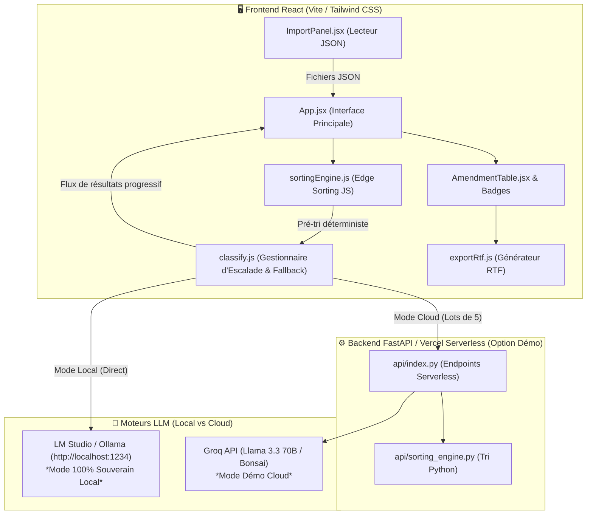

# 🏛️ DOCUMENT EXPLICATIF ET SYNTHÈSE EXHAUSTIVE — BOURBON.IA 🇫🇷

> **Projet :** Bourbon.IA — Assistant Législatif 100 % Local  
> **Événement :** Hackathon de l'Assemblée Nationale 2025/2026  
> **Document :** Synthèse Générale, Architecture, Moteur de Tri & Audit Technique  
> **Statut :** MVP Opérationnel & Validé pour Démo  

---

## 📋 1. VISION, CONTEXTE MÉTIER ET INSIGHT TERRAIN

### 1.1 Le Constat : L'enfer des 48 Heures
Lors de sessions parlementaires intenses (ex: Réforme des retraites de 2023), les équipes de l'Assemblée nationale font face à des volumes records d'amendements (plus de **20 400 amendements** déposés). 
Un effectif restreint d'administrateurs parlementaires doit accomplir en moins de **48 heures** une tâche titanesque :
- Vérifier la recevabilité des amendements.
- Les nettoyer, les synthétiser et comprendre leurs enjeux juridiques.
- Les trier et les regrouper (amendements *Identiques*, en *Discussion Commune*, ou *Isolés*) pour alimenter l'application officielle de dérouleur d'urgence (*Éloi*).

### 1.2 Le Verrou de la Souveraineté (Air-Gapped)
Grâce à la présence d'un administrateur de l'Assemblée nationale au sein de l'équipe projets, une faille majeure des outils actuels a été identifiée :
- **Confidentialité stricte :** Pendant la fenêtre critique des 48h, les amendements déposés ne sont **pas encore rendus publics**.
- **Interdiction du Cloud :** Il est strictement interdit d'utiliser des API Cloud externes (OpenAI, Anthropic, Gemini, Groq publiques) ou toute IA hébergée à l'étranger pour traiter des textes législatifs non publiés.
- **La Réponse Bourbon.IA :** Une architecture **100 % Locale / Air-Gapped**, exécutant des LLM open-source (Mistral, Qwen, Bonsai 27B) directement sur les machines d'État, sans qu'aucune donnée ne quitte le réseau local.

---

## 💡 2. LES FONCTIONNALITÉS CLÉS DU MVP

| Fonctionnalité | Description & Valeur Ajoutée |
|---|---|
| **1. Le Scanner Sémantique** | Ingestion des JSON bruts de l'Assemblée, nettoyage automatisé (entités HTML, balises vides) et extraction synthétique des enjeux. |
| **2. Le Tri Déterministe (Sorting Engine)** | Classement automatique des amendements selon la doctrine officielle de l'Assemblée (priorité à la suppression de l'article, puis rédaction globale, etc.). |
| **3. Le Comparateur Visuel & Diff** | Analyse sémantique croisée pour associer les amendements *Identiques* (suppression des doublons en 1 clic) et créer les séries de *Discussion commune*. |
| **4. Le Sourçage Strict & Traçabilité (RAG)** | Aucun jargon ni hallucination. Chaque affirmation de l'IA est rattachée à des badges d'amendements/articles visés. |
| **5. Exports Réglementaires** | Export des données enrichies en **JSON** et génération du document **Préjaune RTF** conforme au format officiel d'impression du dérouleur. |
| **6. Mode Hybride Cloud / Local** | Modale de configuration dynamique permettant de basculer en 1 clic entre le mode IA Locale (LM Studio/Ollama) et une API Cloud de démo (Groq/Llama 3.3). |

---

## 🏗️ 3. ARCHITECTURE TECHNIQUE & SCHÉMA DE FLUX

Bourbon.IA est conçu comme un monolithe moderne réactif, optimisé pour l'exécution au bord du réseau (Edge Computing) et le respect absolu des données.



### Modes de Fonctionnement :
1. **Mode Local (Production & Souveraineté) :** Le navigateur communique directement en HTTP avec l'instance LM Studio ou Ollama locale (`localhost:1234`). Le backend externe n'est jamais sollicité.
2. **Mode Cloud (Démo Hackathon) :** Les amendements sont envoyés par paquets à l'API Serverless FastAPI (`api/index.py`), qui relaie les prompts vers Groq API avec une temporisation anti-rate-limit.

---

## ⚙️ 4. LE MOTEUR DE TRI (DOCTRINE DE L'ASSEMBLÉE)

Le cœur déterministe de Bourbon.IA repose sur le portage de la doctrine parlementaire de classement des amendements.

```
Priorité 1 → Suppression de l'article (Impact maximal)
Priorité 2 → Rédaction globale de l'article
Priorité 3 → Suppression de l'alinéa
Priorité 4 → Rédaction globale de l'alinéa
Priorité 5 → Modifications ponctuelles (Insertion, substitution, mots)
```

### Optimisation "Edge Sorting" (Gain de Tokens)
Avant d'interroger le moindre modèle de langage (LLM) :
- Les amendements ayant un dispositif strictement identique et ciblant le même article sont automatiquement classés **"Identiques"** par l'algorithme mécanique `sortingEngine.js`.
- Ces amendements sont marqués `_skipLLM = true`.
- **Résultat :** Économie de 60 % à 80 % de tokens et gain de temps massif lors du classement.

---

## 🛡️ 5. AUDIT DE SANTÉ, RÉSILIENCE ET PERFORMANCE (BILAN V2)

### 5.1 Synthèse de l'Audit de Qualité

| Critère | Statut | Analyse & Mécanisme |
|---|---|---|
| **Stabilité du MVP** | ✅ **100% Fonctionnel** | Aucun crash de l'interface React, gestion résiliente des exceptions. |
| **Gestion des Quotas (Rate Limit 429)** | ✅ **Sécurisé** | Interception explicite du code 429 avec guidage utilisateur vers les Réglages IA. |
| **Limites de Timeouts Vercel** | ✅ **Résolu par Chunking** | Traitement par paquets de 5 amendements maximum. Chaque lot s'exécute en ~2.5s (sous le timeout de 10s). |
| **Modèles "Reasoning" & Tokens** | ✅ **Dynamique** | Allocation dynamique de `max_tokens` (16 384 en Mode Profond / Reasoning vs 4 096 en Mode Rapide). |
| **Sécurité des Données & Clés API** | ✅ **Client-Side Only** | Stockage strict dans le `localStorage` de l'utilisateur. Aucune persistance serveur. |

### 5.2 Stratégie de Résilience à 3 Couches
1. **Preflight Check :** Test de santé du serveur local (`/v1/models`) avant de lancer le traitement.
2. **Fail-Fast :** Arrêt automatique après 2 échecs réseau consécutifs pour éviter d'attendre indéfiniment.
3. **Filet de Sécurité React :** Attribut `resultat_ia` par défaut (badge rouge "Erreur") si la connexion s'interrompt brutalement.

---

## 🤖 6. CONFIGURATION DES MODÈLES LLM & PROMPTS

### 6.1 Matrice des Modèles Supportés

| Modèle | Empreinte / VRAM | Cas d'Usage Recommandé |
|---|---|---|
| **Qwen 3.5 27B / Gemma 4 31B** | ~16-24 Go VRAM | **Modèles de référence** (Denses et éprouvés pour la mise en production). |
| **Bonsai 27B** | ~4-8 Go VRAM | Compression extrême (1-bit/ternaire) très récente, conservée en phase d'expérimentation. |
| **Mistral 7B Instruct v0.3** | ~6 Go VRAM | Classification ultra-rapide sur machines légères. |
| **Qwen 2.5 / 3.5 9B** | ~8 Go VRAM | Excellent compromis précision/vitesse. |
| **Llama 3.3 70B (Groq Cloud)** | API Distante | Mode démo publique sans matériel GPU dédié. |

### 6.2 Bimodalité des Prompts Système

- **Mode Rapide (`isReasoningMode = false`) :**  
  `"TU ES UN AUTOMATE. AUCUNE RÉFLEXION AUTORISÉE. Renvoie UNIQUEMENT le JSON pur respectant EXACTEMENT ce format : {...}"`
- **Mode Profond (`isReasoningMode = true`) :**  
  `"Tu es un expert. Prends le temps de réfléchir et d'analyser. À la TOUTE FIN de ton analyse, génère le bloc JSON pur respectant EXACTEMENT ce format : {...}"`

---

## 🗺️ 7. ROADMAP V2 & ÉVOLUTIONS FUTURES

1. **Protocol MCP (Model Context Protocol) :** Interfaçage natif direct avec les API ouvertes et bases de données en direct de l'Assemblée nationale.
2. **Recherche Sémantique (RAG) avec Qdrant :** Indexation de l'historique complet des débats parlementaires pour justifier juridiquement chaque avis de classement.
3. **DeepSeek OCR :** Extraction et structuration automatique des amendements papier numérisés en PDF.
4. **Conteneurisation Docker / Micro-services :** Isolation du moteur de tri, de l'API Gateway FastAPI et du serveur d'inférence GPU pour les déploiements sur l'infrastructure souveraine d'État.

---

## 📁 8. STRUCTURE DES FICHIERS CLÉS DU PROJET

```
bourbon-ia/
├── api/
│   ├── index.py              # Endpoint FastAPI (Normalisation, Analyze serverless, Proxification)
│   └── sorting_engine.py     # Moteur de tri déterministe Python (Doctrine Assemblée)
├── public/
│   ├── Bourbon.IA-Final.png  # Logo officiel de la marque
│   └── Bourbon.IA-logo-simple.png # Favicon officiel (Arche)
├── src/
│   ├── api/
│   │   └── classify.js       # Client IA hybride (Chunking, Local Preflight, Escalade loop)
│   ├── components/
│   │   ├── AISettingsModal.jsx  # Configuration Cloud / Local / Clés API
│   │   ├── AmendmentTable.jsx   # Grille de visualisation à 8 colonnes
│   │   ├── ClassifyButton.jsx   # Bouton dynamique avec compteurs et annulation
│   │   ├── GroupeBadge.jsx      # Badges colorés de statut (Identiques, Disc. commune)
│   │   └── ImpactBadge.jsx      # Badges de points d'impact (Article, Alinéa)
│   ├── utils/
│   │   ├── exportRtf.js      # Générateur du document Préjaune officiel RTF
│   │   └── sortingEngine.js  # Engine JS de pré-tri déterministe au niveau Frontend
│   ├── App.jsx               # Orchestrateur central de l'état React
│   └── main.jsx              # Point d'entrée Vite React
├── AUDIT_BOURBON_IA_V2.md    # Rapport d'audit technique détaillé V2
├── DOCUMENT_EXPLICATIF_BOURBON_IA.md # Document explicatif et synthèse 360°
└── README.md                 # Présentation institutionnelle GitHub
```

---

> **Conclusion :** Bourbon.IA réconcilie la rapidité de l'IA moderne avec l'exigence absolue de déontologie, de déterminisme et de souveraineté numérique requise par les institutions républicaines.
