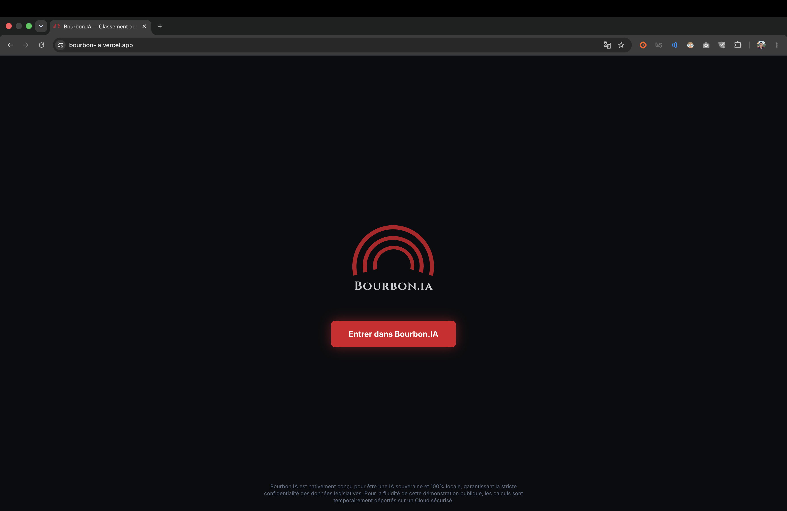
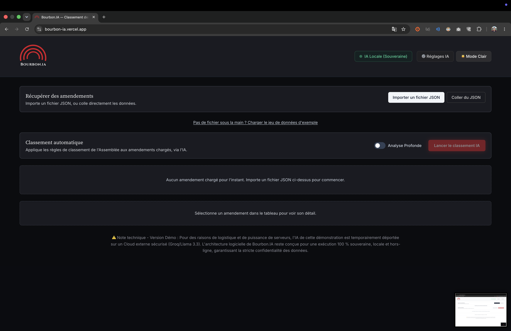
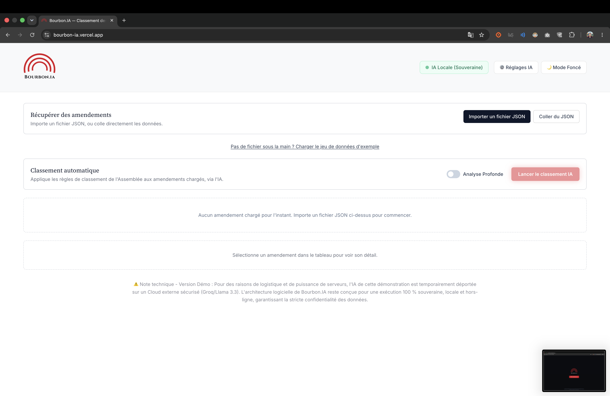
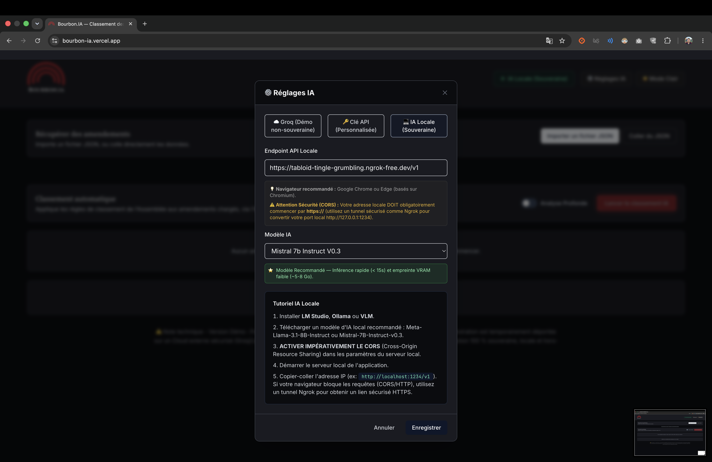
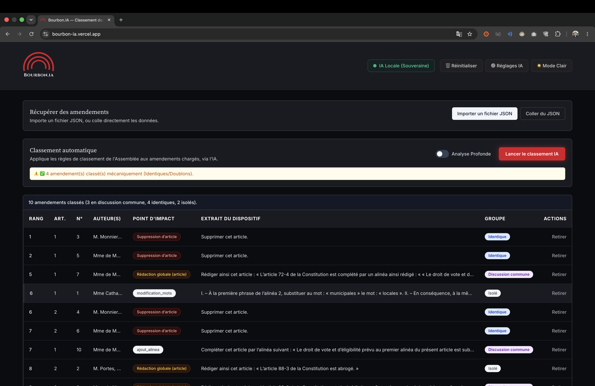

# 🇫🇷 Bourbon.IA — L'Assistant Législatif 100 % Local

**🔗 Démonstration en ligne :** [bourbon-ia.vercel.app](https://bourbon-ia.vercel.app)

---

## 🎯 Le Défi : L'enfer des 48 heures et la Souveraineté

Grâce à l'expertise métier d'un administrateur de l'Assemblée nationale présent dans notre équipe, nous avons ciblé le vrai blocage : le traitement de volumes écrasants d'amendements dans des délais inhumains. Lors de la réforme des retraites en 2023, **20 400 amendements** ont dû être triés, classés et analysés en **moins de 48 heures** par les équipes parlementaires.

Pour des questions de **confidentialité absolue**, l'usage d'IA Cloud classiques (OpenAI, Anthropic, etc.) est strictement interdit sur les textes législatifs en cours d'examen. Il fallait une solution **"Air-Gapped"** : une IA souveraine, locale, déconnectée d'Internet, capable de tourner intégralement sur les machines de l'Assemblée.

Bourbon.IA est cette solution.

### 🎬 Démonstration Vidéo
<video src="hackathon-an-2026/docs/Bourbon-IA-Démo.mp4" controls width="100%"></video>

### 📸 Aperçu de l'Interface






---

## 💡 La Solution & Architecture (MVP V1)

### Edge Computing — Pré-tri Front-End
L'interface React gère l'import de multiples fichiers JSON (format officiel de l'Assemblée nationale) et effectue un **tri mécanique instantané** (doublons stricts, détection par regex du dispositif) directement dans le navigateur. Ce pré-tri déterministe économise les ressources IA en ne transmettant au LLM que les amendements réellement ambigus.

### Sécurité & Architecture — Monolithe Assumé
Pour les besoins du Hackathon, le prototype est un monolithe volontaire. Ce choix d'architecture favorise la vélocité d'itération et la démonstration rapide.

> **🔒 Garantie de sécurité :** Les clés API (utilisées uniquement pour la démo publique) sont strictement stockées côté client (`localStorage` du navigateur) et **ne sont jamais transmises ni sauvegardées sur nos serveurs**. Aucune donnée législative ne transite vers un tiers.

Pour une mise en production, l'architecture évoluera vers des **Micro-services conteneurisés** (Docker/K8s) avec chiffrement de bout en bout.

### 🧠 Moteurs LLM & Inférence Locale Dynamique
L'application est configurée pour fonctionner en local avec une gestion intelligente de la mémoire vidéo (VRAM). Le Front-end interroge l'API native du serveur local, calcule l'empreinte mémoire au mégaoctet près, décharge automatiquement les anciens modèles pour éviter les crashs (*Out of Memory*), et adapte ses prompts selon l'architecture du modèle.

Notre configuration de référence :
| Modèle | Type | Usage recommandé |
|---|---|---|
| **Meta-Llama 3.1 8B / Mistral 7B** | Instruct | ⭐ **Modèle Recommandé :** Inférence ultra-rapide (< 15s) et classification parfaite. Idéal pour les GPU standards (8 Go VRAM). |
| **Gemma 4 12B (QAT)** | Reasoning | 🟡 **Analyse approfondie :** Pensée bridée automatiquement par le front-end pour optimiser la vitesse sans perdre en précision. |
| **Qwen 3.5 35B / QWQ 32B** | Dense | 🔵 **Traitement volumineux :** Modèles lourds réservés aux serveurs disposant de plus de 16 Go de VRAM. |

### ⚡ Innovations V1.5 (Gestion Adaptative)
- Déchargement automatique de la VRAM (Unload) lors de la bascule de modèle local dans la modale.
- Adaptation dynamique des prompts et des températures (0.1 vs 0.2) selon l'architecture du modèle (Reasoning vs Instruct).
- Détection heuristique de la VRAM via l'API native `v0` de LM Studio.

---

## 🚀 Roadmap Technique (V2)

- **Connexion MCP (Model Context Protocol) :** Branchement direct sur les flux de données de l'Assemblée nationale pour aspirer les amendements en temps réel, sans import manuel.
- **DeepSeek OCR :** Ingestion et structuration automatique des anciens amendements scannés ou au format PDF non-exploitable.
- **Recherche Sémantique (RAG) :** Déploiement de Qdrant et AnythingLLM pour interroger l'historique législatif complet de l'Assemblée et sourcer chaque réponse de l'IA avec des références exactes.
- **Architecture Micro-services :** Séparation du moteur de tri, du serveur LLM et de l'API Gateway dans des conteneurs indépendants pour la scalabilité et la résilience.

---

## ⚙️ Installation & Lancement

### Prérequis
- **Node.js 18+** et **npm**
- **Python 3.10+** (pour le backend FastAPI)
- **LM Studio** (pour le mode IA locale, sur le port `1234`)

### Front-End (React / Vite)
```bash
# Installer les dépendances
npm install

# Lancer le serveur de développement (port 5173)
npm run dev
```

### Back-End Python (FastAPI)
En production (sur Vercel), le backend tourne de manière autonome et Serverless. En environnement local, il est impératif de lancer le serveur manuellement :

```bash
# Optionnel : activer un environnement virtuel
python3 -m venv .venv
source .venv/bin/activate

# Installer les dépendances
pip install -r requirements.txt

# Lancer le serveur (port 8000)
uvicorn api.index:app --reload
```

### LLM Local (LM Studio)
1. Installer [LM Studio](https://lmstudio.ai/)
2. Charger un modèle (ex: Bonsai 27B, Mistral 7B, Qwen 2.5)
3. Démarrer le serveur local sur le port `1234`
4. **Activer le CORS** dans les paramètres du serveur LM Studio
5. Dans Bourbon.IA, ouvrir les ⚙️ Réglages IA et sélectionner "IA Locale"

---

## 👥 L'Équipe

| Rôle | Nom |
|---|---|
| **Porteur de projet** | Justin Bandiola |
| **Expertise métier** | Un administrateur de l'Assemblée nationale |
| **Contributeurs** | Yassine Yamani, Ralph Ferghali, Basile Nordmann, Sahel Salimi, Anwar Labib, Claudia Trujillo, Nicaise CHOUNGMO FOFACK |

---

*Hackathon Assemblée nationale 2026 — Équipe Bourbon.IA*
