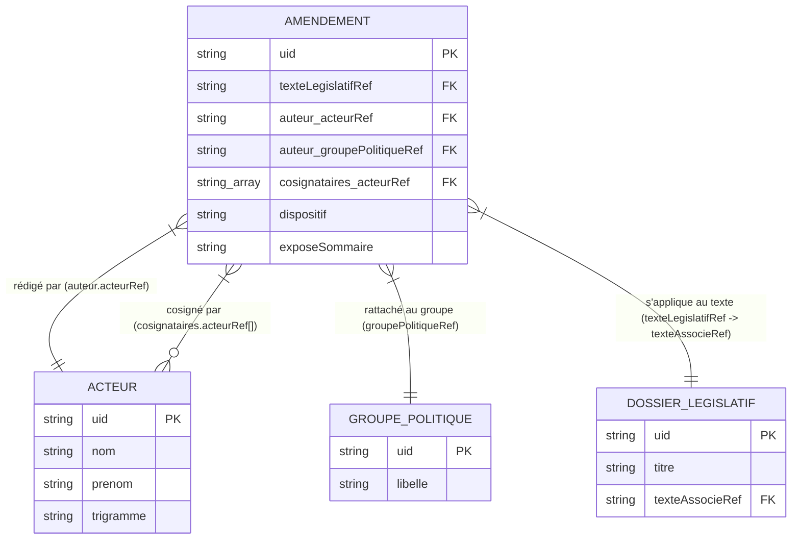

# 📊 DOCUMENTATION DE MAPPING ET STRUCTURE DES DONNÉES — LES TRICOTEUSES

Ce document dresse une analyse technique de la structure interne des fichiers JSON nettoyés issus des dépôts GitLab des **Tricoteuses** (Assemblée nationale), pour préparer le futur croisement et l'enrichissement des données dans **Bourbon.IA**.

---

## 1. 📜 SCHÉMA AMENDEMENT (`Amendements_XVII_nettoye`)

*Exemple de fichier source :* `AMANR5L17PO838901BTC2428P0D1N000052.json`

| Champ JSON | Type | Description / Rôle métier |
| :--- | :--- | :--- |
| `amendement.uid` | `String` | **Clé Primaires (PK)** unique de l'amendement (ex: `AMANR5L17PO838901BTC2428P0D1N000052`). |
| `amendement.identification.numeroLong` | `String` | Numéro d'affichage officiel de l'amendement (ex: `"52"`). |
| `amendement.texteLegislatifRef` | `String` | **Clé Étrangère (FK)** vers le texte de loi/proposition visé (ex: `"PIONANR5L17BTC2428"`). |
| `amendement.examenRef` | `String` | Référence de l'examen (commission ou séance publique). |
| `amendement.signataires.auteur.acteurRef` | `String` | **Clé Étrangère (FK)** vers l'Acteur/Député signataire principal (ex: `"PA841749"`). |
| `amendement.signataires.auteur.typeAuteur` | `String` | Type d'auteur (`"Député"`, `"Gouvernement"`, `"Rapporteur"`). |
| `amendement.signataires.auteur.groupePolitiqueRef` | `String` | **Clé Étrangère (FK)** vers l'Organe du groupe politique (ex: `"PO845401"`). |
| `amendement.signataires.cosignataires.acteurRef` | `Array[String]` | Liste de **Clés Étrangères (FK)** des députés cosignataires (`["PA793432", ...]`). |
| `amendement.pointeurFragmentTexte.division` | `Object` | Emplacement visé (`titre`, `articleDesignationCourte` ex: `"ART. PREMIER"`). |
| `amendement.corps.contenuAuteur.dispositif` | `String (HTML)` | Contenu juridique modificateur (dispositif de l'amendement). |
| `amendement.corps.contenuAuteur.exposeSommaire` | `String (HTML)` | Motivation et exposé des motifs par l'auteur. |
| `amendement.cycleDeVie.etatDesTraitements.etat.code` | `String` | État d'avancement (`"ET"` En traitement, `"Adiscussion"`, etc.). |

---

## 2. 👤 SCHÉMA ACTEUR / DEPUTÉ (`AMO30_nettoye`)

*Exemple de fichier source :* `acteurs/PA840721.json`

| Champ JSON | Type | Description / Rôle métier |
| :--- | :--- | :--- |
| `uid` | `String` | **Clé Primaire (PK)** unique du député/acteur (ex: `"PA840721"`). |
| `etatCivil.ident.civ` | `String` | Civilité (`"M."` / `"Mme"`). |
| `etatCivil.ident.nom` | `String` | Nom de famille (ex: `"Chavent"`). |
| `etatCivil.ident.prenom` | `String` | Prénom (ex: `"Marc"`). |
| `etatCivil.ident.trigramme` | `String` | Trigramme d'identification parlementaire (ex: `"MCH"`). |
| `profession.libelleCourant` | `String` | Intitulé professionnel (ex: `"Cadre de la fonction publique"`). |
| `adresses[]` | `Array[Object]` | Adresses officielles, e-mails (`valElec`), téléphones. |
| `mandats[]` | `Array[Object]` | Liste de tous les mandats passés et actuels du député. |
| `mandats[].organesRefs` | `Array[String]` | **Clés Étrangères (FK)** vers les organes rattachés (Groupe Politique `PO...`, Commission `PO...`). |
| `mandats[].election.lieu` | `Object` | Circonscription d'élection (`departement`, `numCirco`, `region`). |

---

## 3. 📁 SCHÉMA DOSSIER LÉGISLATIF (`Dossiers_Legislatifs_XVII_nettoye`)

*Exemple de fichier source :* `dossiers/.../DLR5L11N19503.json`

| Champ JSON | Type | Description / Rôle métier |
| :--- | :--- | :--- |
| `uid` | `String` | **Clé Primaire (PK)** unique du dossier (ex: `"DLR5L11N19503"`). |
| `legislature` | `String` | Législature associée (ex: `"17"`). |
| `titreDossier.titre` | `String` | Titre officiel du projet ou de la proposition de loi. |
| `procedureParlementaire.libelle` | `String` | Type de procédure (ex: `"Projet ou proposition de loi constitutionnelle"`). |
| `initiateur.acteurs[].acteurRef` | `Array[Object]` | **Clé Étrangère (FK)** vers le/les auteur(s) de l'initiative loi. |
| `actesLegislatifs[]` | `Array[Object]` | Arborescence des étapes parlementaires (1ère lecture, commission, etc.). |
| `actesLegislatifs[].texteAssocieRef` | `String` | **Clé de rattachement** du texte discuté (ex: `"PIONANR5L11B2063"`). |

---

## 🔗 4. MATRICE DES CLÉS DE JOINTURE (RELATIONAL MAPPING)

### Synthèse des jointures applicatives :

1. **Amendement ➔ Acteur (Auteur)** :
   `amendement.signataires.auteur.acteurRef` ➔ `acteur.uid`  
   *(Ex: `PA841749` permet d'obtenir directement le nom, prénom et la circonscription du député).*

2. **Amendement ➔ Cosignataires** :
   `amendement.signataires.cosignataires.acteurRef[]` ➔ `acteur.uid`  
   *(Permet d'extraire la liste complète des députés co-auteurs).*

3. **Amendement ➔ Groupe Politique** :
   `amendement.signataires.auteur.groupePolitiqueRef` ➔ `organe.uid` (Type `GP`, ex: `PO845401` = Rassemblement National).

4. **Amendement ➔ Dossier Législatif** :
   `amendement.texteLegislatifRef` ➔ `dossier.actesLegislatifs[].texteAssocieRef`  
   *(Également, le sous-dossier parent `DLR5L11N19503/` contenant les amendements porte l'identifiant du dossier législatif).*

---

## 💡 RECOMMANDATIONS POUR LA BASE DE DONNÉES FRONT/BACK

- **Indexation prioritaire** : Indexer sur `acteurRef`, `groupePolitiqueRef` et `texteLegislatifRef` dans SQLite / Firestore pour permettre des filtres instantanés ("Tous les amendements du groupe X sur le projet Y").
- **Dénormalisation légère** : Pour l'affichage instantané sans requêtes n+1, dénormaliser les champs `nom_auteur`, `prenom_auteur` et `groupe_abreviation` directement dans le JSON nettoyé envoyé au Front-End React.
