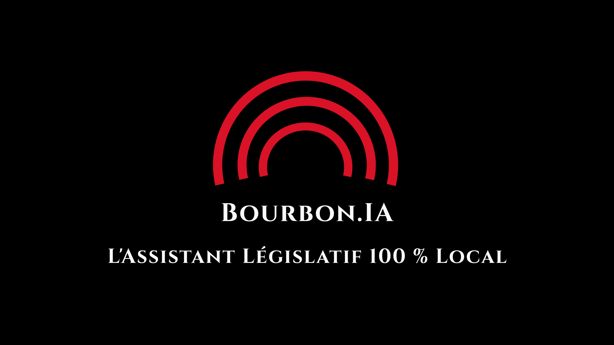
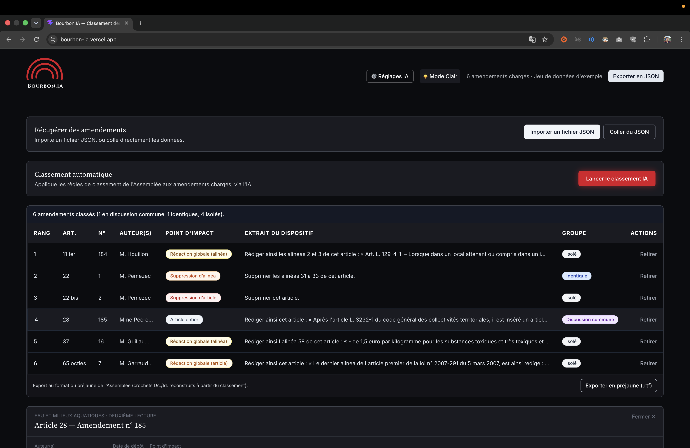
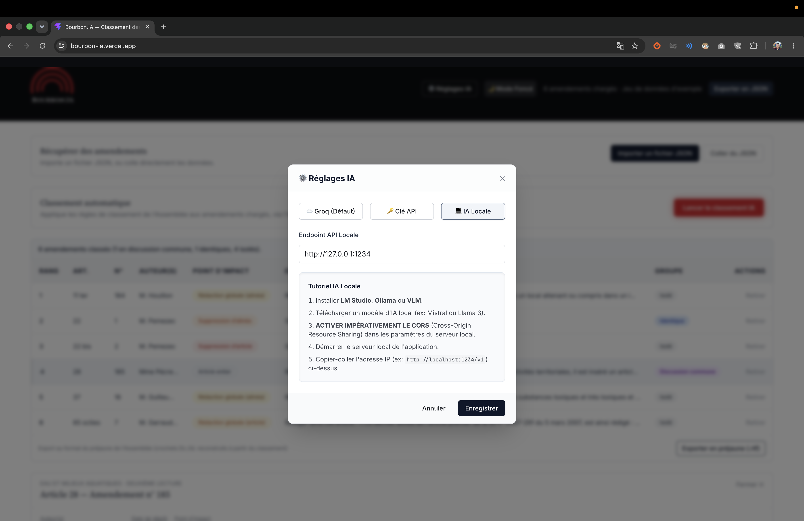

### Nom du défi
Bourbon.IA : L'Assistant Législatif 100 % Local

### Description courte
Bourbon.IA est l'assistant législatif 100% local qui résout le point de douleur n°1 des administrateurs : le tri et le classement des amendements avant leur publication, dans le respect absolu de la déontologie et de la souveraineté numérique.

### Porteur
Justin Bandiola

### Description longue
**Le Constat Terrain : L'enfer des 48 heures**
En 2023, la réforme des retraites a généré un volume record de plus de 20 400 amendements (stratégie d'obstruction). Face à ce mur, un effectif extrêmement réduit d'administrateurs transpartisans doit accomplir un travail titanesque : traiter, trier et classer ce volume écrasant en moins de 48 heures pour alimenter le logiciel de l'Assemblée, *Éloi*.

**La Faille de l'IA Actuelle (L'Insight Métier)**
Grâce à un administrateur de l'Assemblée nationale présent dans notre équipe, nous avons identifié le vrai blocage métier. Pour des questions strictes de déontologie, les administrateurs **ne peuvent pas** utiliser d'IA cloud (ni même les IA publiques d'État) pendant ces 48h, car les amendements ne sont pas encore rendus publics. Les outils IA classiques sont donc inutilisables au moment précis où le besoin est le plus critique.

**La Solution : Bourbon.IA**
Bourbon.IA comble cette faille. C'est un copilote 100 % local (Air-Gapped) qui intervient *avant* la publication, transformant une tâche chronophage et rébarbative en un processus automatisé et souverain :
- **Le Scanner & Le Comparateur :** L'outil classe, résume et identifie sémantiquement les relations complexes : discussions communes, amendements identiques, doublons et isolés.
- **Action Directe (UI) :** L'interface permet de supprimer les doublons en un clic, nettoyant la base de données instantanément.

**Roadmap Technique**
Pour les besoins du Hackathon, le front-end est déployé, mais le backend nécessite de faire tourner un LLM en local sur la machine de l'utilisateur (le prototype actuel est un monolithe). Si la solution est adoptée par l'Assemblée, notre équipe s'engage à faire évoluer ce prototype vers une architecture de production professionnelle (Micro-services, conteneurisation Docker).

### Image principale

### Contributeurs
- Justin Bandiola
- Yassine Yamani
- Claudia

### Ressources utilisées

- [ ] `openfisca-france-parameters` — Base de données de paramètres ✺ OpenFisca
- [ ] `an-dossiers-legislatifs` — Dossiers législatifs de l'Assemblée nationale (législature courante) ✺ Assemblée nationale
- [x] `an-amendements-xvii` — Amendements déposés à l'Assemblée nationale (législature actuelle) ✺ Assemblée nationale
- [ ] `an-comptes-rendus` — Comptes rendus de la séance publique à l'Assemblée nationale (législature actuelle) ✺ Assemblée nationale
- [ ] `an-votes-xvii` — Votes des députés (législature actuelle) ✺ Assemblée nationale
- [ ] `an-deputes-en-exercice` — Députés en exercice ✺ Assemblée nationale
- [ ] `an-deputes-historique` — Historique des députés ✺ Assemblée nationale
- [ ] `an-deputes-senateurs-ministres-par-legislature` — Députés, sénateurs et ministres d'une législature ✺ Assemblée nationale
- [ ] `an-agenda-reunions` — Agenda des réunions à l'Assemblée nationale (législature courante) ✺ Assemblée nationale
- [ ] `an-questions-gouvernement` — Questions de l'Assemblée nationale au Gouvernement ✺ Assemblée nationale
- [ ] `an-questions-gouvernement-ecrites` — Questions écrites de l'Assemblée nationale au Gouvernement ✺ Assemblée nationale
- [ ] `an-questions-gouvernement-orales` — Questions orales de l'Assemblée nationale au Gouvernement ✺ Assemblée nationale
- [ ] `premier-ministre-legi` — Codes, lois et règlements consolidés ✺ Premier ministre
- [ ] `premier-ministre-dole` — Dossiers législatifs Légifrance ✺ Premier ministre
- [ ] `premier-ministre-jorf` — Édition ''Lois et décrets'' du Journal officiel ✺ Premier ministre
- [ ] `senat-dispositifs-textes` — Dispositifs des textes déposés ou adoptés au Sénat ✺ Sénat
- [ ] `senat-dossiers-legislatifs` — Dossiers législatifs du Sénat ✺ Sénat
- [ ] `senat-amendements` — Amendements déposés au Sénat ✺ Sénat
- [ ] `senat-senateurs` — Sénateurs ✺ Sénat
- [ ] `senat-questions-gouvernement` — Questions orales et écrites du Sénat au Gouvernement ✺ Sénat
- [ ] `senat-comptes-rendus` — Comptes rendus de la séance publique au Sénat ✺ Sénat
- [ ] `an-et-co-database-regroupement-toutes-donnees` — Base de données unifiée Parlement / Législation / Service Public ✺ Assemblée nationale & communauté
- [ ] `an-et-co-serveur-mcp-regroupement-toutes-donnees` — Serveur MCP  - Accès unifié Parlement / Législation / Service Public ✺ Assemblée nationale & communauté
- [ ] `an-et-co-api-regroupement-toutes-donnees` — API - Accès unifié Parlement / Législation / Service Public ✺ Assemblée nationale & communauté
- [ ] `legiwatch-api-parlement` — API Parlement ✺ LegiWatch
- [ ] `legiwatch-database-parlement` — Base de données Parlement ✺ LegiWatch
- [ ] `legiwatch-serveur-mcp-parlement` — Serveur MCP Parlement ✺ LegiWatch

### Galerie

### 🎥 Vidéo de Démonstration
[👉 Visionner la démonstration vidéo de Bourbon.IA](lien_vers_la_video_a_remplacer_par_le_tech_lead)

### Documents
- [Diapositives de présentation Bourbon.IA](docs/bourbon.ia.pdf)

### URL de démonstration
https://bourbon-ia.vercel.app/

**Note sur l'infrastructure :** Pour des raisons de puissance de calcul et d'accessibilité publique lors de l'évaluation, l'intelligence artificielle (Groq/Llama 3.3) est temporairement hébergée sur un Cloud sécurisé via une architecture Serverless Vercel. Toutefois, le code de Bourbon.IA est conçu pour être 100 % souverain et peut être exécuté intégralement en local.
