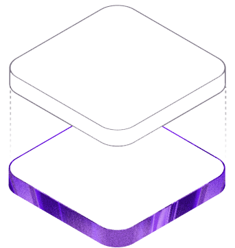

### Nom du défi
Bourbon.IA : L'Assistant Législatif 100 % Local

### Description courte
Application web propulsée par un LLM open source 100% local et "Air-Gapped". Elle permet aux administrateurs de l'Assemblée de résumer, comparer et sourcer strictement les amendements sans compromettre la souveraineté des données.

### Porteur
Justin Bandiola

### Description longue
L'usage d'outils d'IA générative grand public par les équipes parlementaires pose un risque critique de souveraineté. Bourbon.IA est un assistant législatif fonctionnant de manière 100 % locale (hors-ligne). Connecté aux données ouvertes de l'Assemblée (fichiers JSON), le prototype se concentre sur l'assistance au traitement et au classement des amendements via 3 fonctions : Le Scanner, Le Comparateur, et Le Sourçage Strict (RAG).

### Image principale

### Contributeurs
- Justin Bandiola
- Yassine Yamani
- Claudia

### Ressources utilisées

- [ ] `openfisca-france-parameters` — Base de données de paramètres ✺ OpenFisca
- [ ] `an-dossiers-legislatifs` — Dossiers législatifs de l'Assemblée nationale (législature courante) ✺ Assemblée nationale
- [x] `an-amendements-xvii` — Amendements déposés à l'Assemblée nationale (législature actuelle) ✺ Assemblée nationale
- [ ] `an-comptes-rendus` — Comptes rendus de la séance publique à l'Assemblée nationale (législature actuelle) ✺ Assemblée nationale
- [ ] `an-votes-xvii` — Votes des députés (législature actuelle) ✺ Assemblée nationale
- [ ] `an-deputes-en-exercice` — Députés en exercice ✺ Assemblée nationale
- [ ] `an-deputes-historique` — Historique des députés ✺ Assemblée nationale
- [ ] `an-deputes-senateurs-ministres-par-legislature` — Députés, sénateurs et ministres d'une législature ✺ Assemblée nationale
- [ ] `an-agenda-reunions` — Agenda des réunions à l'Assemblée nationale (législature courante) ✺ Assemblée nationale
- [ ] `an-questions-gouvernement` — Questions de l'Assemblée nationale au Gouvernement ✺ Assemblée nationale
- [ ] `an-questions-gouvernement-ecrites` — Questions écrites de l'Assemblée nationale au Gouvernement ✺ Assemblée nationale
- [ ] `an-questions-gouvernement-orales` — Questions orales de l'Assemblée nationale au Gouvernement ✺ Assemblée nationale
- [ ] `premier-ministre-legi` — Codes, lois et règlements consolidés ✺ Premier ministre
- [ ] `premier-ministre-dole` — Dossiers législatifs Légifrance ✺ Premier ministre
- [ ] `premier-ministre-jorf` — Édition ''Lois et décrets'' du Journal officiel ✺ Premier ministre
- [ ] `senat-dispositifs-textes` — Dispositifs des textes déposés ou adoptés au Sénat ✺ Sénat
- [ ] `senat-dossiers-legislatifs` — Dossiers législatifs du Sénat ✺ Sénat
- [ ] `senat-amendements` — Amendements déposés au Sénat ✺ Sénat
- [ ] `senat-senateurs` — Sénateurs ✺ Sénat
- [ ] `senat-questions-gouvernement` — Questions orales et écrites du Sénat au Gouvernement ✺ Sénat
- [ ] `senat-comptes-rendus` — Comptes rendus de la séance publique au Sénat ✺ Sénat
- [ ] `an-et-co-database-regroupement-toutes-donnees` — Base de données unifiée Parlement / Législation / Service Public ✺ Assemblée nationale & communauté
- [ ] `an-et-co-serveur-mcp-regroupement-toutes-donnees` — Serveur MCP  - Accès unifié Parlement / Législation / Service Public ✺ Assemblée nationale & communauté
- [ ] `an-et-co-api-regroupement-toutes-donnees` — API - Accès unifié Parlement / Législation / Service Public ✺ Assemblée nationale & communauté
- [ ] `legiwatch-api-parlement` — API Parlement ✺ LegiWatch
- [ ] `legiwatch-database-parlement` — Base de données Parlement ✺ LegiWatch
- [ ] `legiwatch-serveur-mcp-parlement` — Serveur MCP Parlement ✺ LegiWatch

### Galerie

### Documents
- [Diapositives de présentation Bourbon.IA](docs/bourbon.ia.pdf)

### URL de démonstration
https://de85f219-55ec-4ec4-94e0-ea61a4794dda.frp.hackathon2026.leximpact.dev
